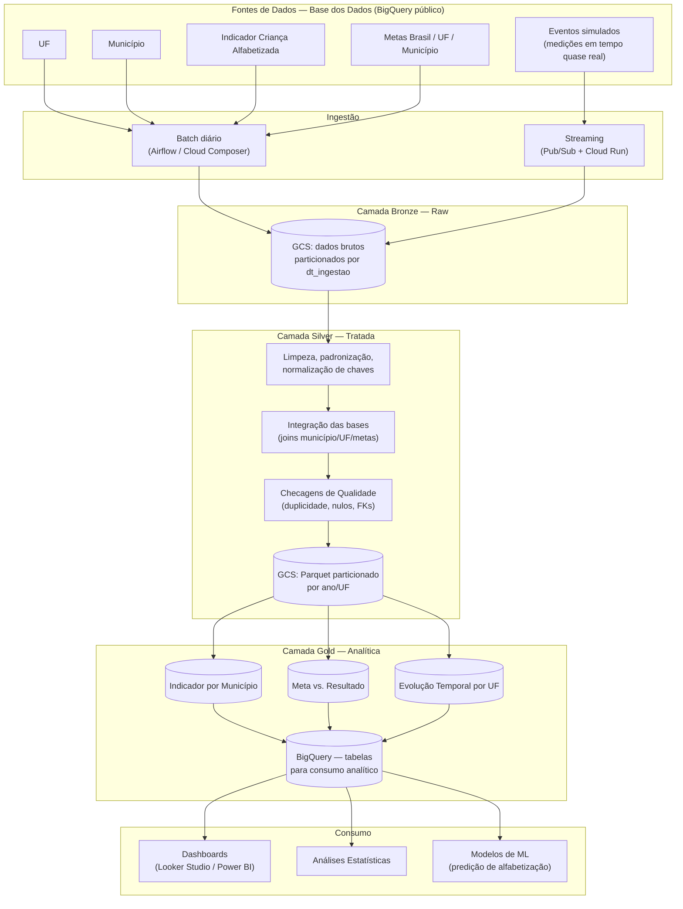

# Diagrama da Pipeline

## Fluxo de dados (resumo textual)

1. **Extração (Batch)** — Diariamente, o Airflow dispara jobs que leem as
   tabelas `uf`, `município`, `indicador_alfabetizacao` e `meta_*`
   diretamente do BigQuery público da Base dos Dados.
2. **Extração (Streaming)** — Um simulador publica eventos de
   atualização de indicador/meta em um tópico Pub/Sub; um consumidor
   grava micro-lotes (60s ou 500 msgs) continuamente.
3. **Bronze** — Ambos os fluxos pousam sem transformação em GCS,
   particionados por data de ingestão, preservando histórico completo.
4. **Silver** — Um job PySpark (SparkSession local, disparado pelo
   Airflow) lê a Bronze, limpa, padroniza tipos/nomes,
   normaliza chaves, integra as bases via join e passa pelas checagens
   de qualidade antes de gravar.
5. **Gold** — Três datasets analíticos são gerados a partir da Silver e
   publicados também como tabelas no BigQuery.
6. **Consumo** — Dashboards, análises estatísticas e modelos de ML
   consultam a camada Gold via BigQuery.
